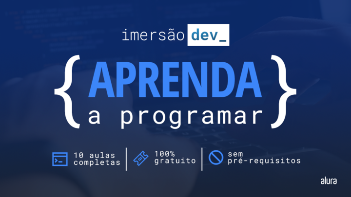

## 💻 Sobre
Com a proposta de desenvolver projetos durante 10 dias, a [Alura](https://www.alura.com.br) apresenta mais uma Imersão Dev focada em um público que nunca programou antes.
## 📚 Roteiro

- [x] Dia 01: Moedas e Variáveis no Javascript
- [x] Dia 02: Calculadora e laços condicionais no Javascript
- [ ] Dia 03:
- [ ] Dia 04:
- [ ] Dia 05:
- [ ] Dia 06:
- [ ] Dia 07:
- [ ] Dia 09:
- [ ] Dia 10:
## 💼 Tecnologias

- HTML
- CSS
- Javascript
